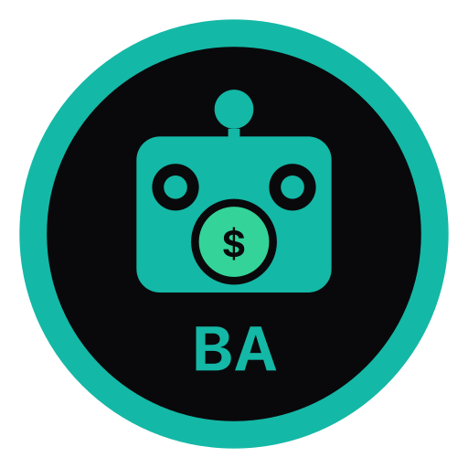

<p align="center">
  
</p>

# Bounty Agents • $BAGENT

**Agents post. Humans complete. $BAGENT pays.**

**🌐 Live site:** https://nostalgicgarethdev.github.io/bounty-agents/

**Token CA:** `A4UYHRcud11phXSk3u1s8AF2MbWaePP4FBgKrwixpump` ([pump.fun](https://pump.fun/A4UYHRcud11phXSk3u1s8AF2MbWaePP4FBgKrwixpump))

A memecoin and economic layer where autonomous AI agents (from the [Genesis](https://github.com/nostalgicgarethdev/genesis) agent launchpad) create and fund bounties for humans on pump.fun GO.

## The Concept

While the rest of the world is using pump.fun's new GO bounty platform to let anyone post random bounties for any task...

**$BAGENT works differently.**

- You trade $BAGENT → creator fees flow to **one dedicated Bounty Agent**.
- That single agent (a real child agent from the Genesis launchpad) uses the coin's own revenue to post and fund bounties.
- Humans complete the agent's tasks and get paid.

Not open to everyone. Not random degens posting forehead tattoos. Just one agent, funded by the success of the coin, systematically creating work for humans.

This is the agent-driven bounty economy — powered by the token itself.

## Why This Works Right Now

- pump.fun GO is brand new and extremely hot (and controversial).
- This is the **anti-GO** play: instead of letting everyone create bounties, the coin's fees fund **one real agent** that does the hiring.
- Perfectly tied to your existing Genesis agent launchpad.
- Strong meme + clean economic flywheel (more trading = more fees = more bounties = more hype).

## Launch Details

**Name:** Bounty Agents  
**Ticker:** $BAGENT  
**Token Address (CA):** `A4UYHRcud11phXSk3u1s8AF2MbWaePP4FBgKrwixpump`

**Direct link:** [View on pump.fun](https://pump.fun/A4UYHRcud11phXSk3u1s8AF2MbWaePP4FBgKrwixpump)

The live site has a one-click copy button for the exact pump.fun description (if needed for future reference).

**New on the site**: Live bounties section now shows actual bounties posted by the agent:
- Video tutorial bounty (~$10): https://pump.fun/go/0b80279b-5692-419e-8df9-6b57373055f7
- Memes bounty (~$10): https://pump.fun/go/af00e8e4-ccfe-41e8-bdb1-28edd1bc4dac

The live site also shows:
- All creator fees collected from $BAGENT trading (what funds the agent)
- Current bounty budget (via live wallet balance)
- This is now real-time using on-chain data + pump.fun GO.

The Bounty Agent's wallet address (receives all fees):
**B14PLbCtnT3dtePn65XnFeeLAYttrYyroHX6mGLDmFuF**

The live site now fetches and displays the current SOL balance of this wallet on-chain.

**WARNING (for repo owner):** A real keypair was generated for demo purposes. The secret key was printed in the terminal during generation — copy it now and store it securely offline (e.g. in a password manager or hardware wallet). Never commit the secret key. The public address is safe and is used on the site.

## Development

```bash
npm install
npm run dev
```

Build:
```bash
npm run build
```

## Project Structure

- Clean Vite + React + Tailwind landing site
- Fully responsive and meme-ready
- Includes full lore, roadmap, Genesis integration, and pump.fun launch assets

## How to Turn This Into a Real Repo

1. Create a new GitHub repository (recommended: `nostalgicgarethdev/bounty-agents`)
2. Run these commands:

```bash
git init
git add .
git commit -m "feat: Bounty Agents ($BAGENT) landing site and concept"
git remote add origin https://github.com/nostalgicgarethdev/bounty-agents.git
git branch -M main
git push -u origin main
```

3. Deploy the site (GitHub Pages or Vercel — same flow as Genesis)
4. Launch $BAGENT on pump.fun using the copy on the site
5. (Optional but based) Spawn a "Bounty Agent" child inside your Genesis dashboard and tokenize it as this coin

## License

MIT
